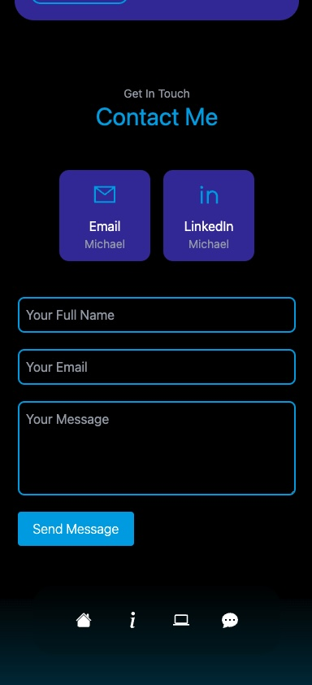

# Portfolio Site

New Portfolio site, this site is currently live at https://norris-webdev.com/ <br />

## Technology used

- Next.js
- Tailwind CSS
- Email.js


## Project Screen Shots




## Reflection

Feeling the need to create a better portfolio website and to understand and learn more about Tailwind CSS framework, I created a new portfolio website. <br />

Admittley, having weak design skills, I used a portfolio design from youtube and tweaked some of the design. I know I have strong CSS skills, but I wanted to improve my toolset with Tailwind CSS. The youtube video I was following for design inspiration was using CSS components which was of no use to me. This allowed me to sharpen my Tailwind CSS skills quickly! Thankfully, I had experience with flexbox design, so it only took a few lines of Tailwind CSS to understand the flow of the framework.  <br />


This is a [Next.js](https://nextjs.org/) project bootstrapped with [`create-next-app`](https://github.com/vercel/next.js/tree/canary/packages/create-next-app).

## Getting Started

First, run the development server:

```bash
npm run dev
# or
yarn dev
```

Open [http://localhost:3000](http://localhost:3000) with your browser to see the result.

You can start editing the page by modifying `pages/index.js`. The page auto-updates as you edit the file.

[API routes](https://nextjs.org/docs/api-routes/introduction) can be accessed on [http://localhost:3000/api/hello](http://localhost:3000/api/hello). This endpoint can be edited in `pages/api/hello.js`.

The `pages/api` directory is mapped to `/api/*`. Files in this directory are treated as [API routes](https://nextjs.org/docs/api-routes/introduction) instead of React pages.

## Learn More

To learn more about Next.js, take a look at the following resources:

- [Next.js Documentation](https://nextjs.org/docs) - learn about Next.js features and API.
- [Learn Next.js](https://nextjs.org/learn) - an interactive Next.js tutorial.

You can check out [the Next.js GitHub repository](https://github.com/vercel/next.js/) - your feedback and contributions are welcome!

## Deploy on Vercel

The easiest way to deploy your Next.js app is to use the [Vercel Platform](https://vercel.com/new?utm_medium=default-template&filter=next.js&utm_source=create-next-app&utm_campaign=create-next-app-readme) from the creators of Next.js.

Check out our [Next.js deployment documentation](https://nextjs.org/docs/deployment) for more details.
